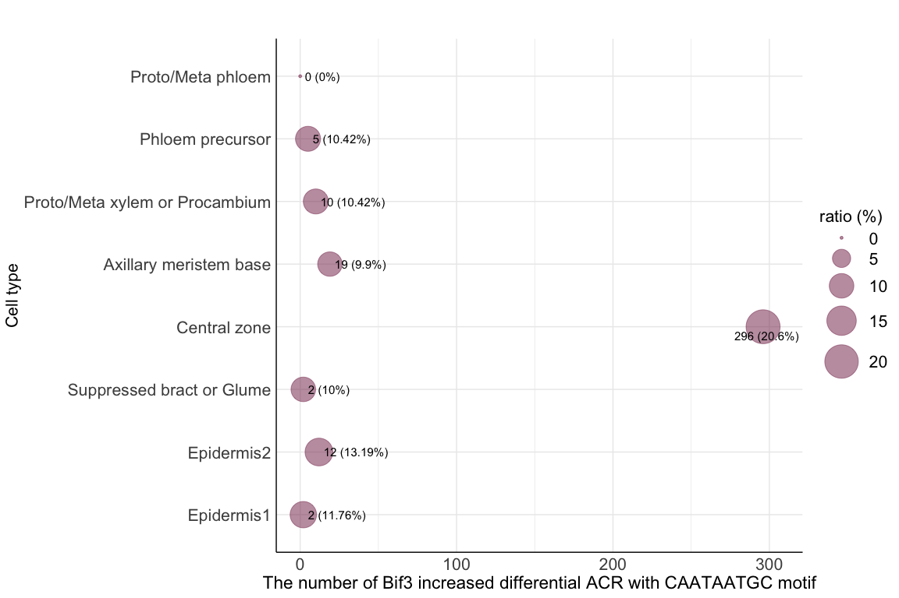

DotPlot_FimoCounts_AATAATGC
================
Sohyun Bang

## Load the data and curate the table

``` r
fimo_files <- list.files(path = ".", pattern = "fimo.tsv", recursive = TRUE, full.names = TRUE)
fimo_files <- fimo_files[str_detect(fimo_files, "Revision_")]

fimo_list <- setNames(
  lapply(fimo_files, function(file) {
    read_tsv(file, comment = "#", show_col_types = FALSE)
  }),
  basename(dirname(fimo_files)) )
names(fimo_list)
```

    ## [1] "Revision_FloralMeristem_SuppressedBract.FDR0.05Bif3Higher"                       
    ## [2] "Revision_IM-OC.FDR0.05Bif3Higher"                                                
    ## [3] "Revision_L1.FDR0.05Bif3Higher"                                                   
    ## [4] "Revision_L1atFloralMeristem.FDR0.05Bif3Higher"                                   
    ## [5] "Revision_PhloemPrecursor.FDR0.05Bif3Higher"                                      
    ## [6] "Revision_ProcambialMeristem_ProtoXylem_MetaXylem.FDR0.05Bif3Higher"              
    ## [7] "Revision_ProtoPhloem_MetaPhloem_CompanionCell_PhloemParenchyma.FDR0.05Bif3Higher"
    ## [8] "Revision_SPM-base_SM-base.FDR0.05Bif3Higher"

``` r
Celltype_counts <- sapply(fimo_list, function(df) {
  if (nrow(df) == 0) {
    return(0)  
  } else {
    length(unique(df$sequence_name))
  }
})


FimoResult <- tibble(
  Cell_type = names(Celltype_counts),
  AATAATGC_ACR_count = as.integer(Celltype_counts),
  dACR_Bif3Higher_count = c(20,1437,17,91,48,96,2,192))

## Curate cell type names
FimoResult <- FimoResult %>%
  mutate(Cell_type = case_when(
    Cell_type == "Revision_FloralMeristem_SuppressedBract.FDR0.05Bif3Higher" ~ "Suppressed bract or Glume",
    Cell_type == "Revision_PhloemPrecursor.FDR0.05Bif3Higher" ~ "Phloem precursor",
    Cell_type == "Revision_IM-OC.FDR0.05Bif3Higher" ~ "Central zone",
    Cell_type == "Revision_L1.FDR0.05Bif3Higher" ~ "Epidermis1",
    Cell_type == "Revision_L1atFloralMeristem.FDR0.05Bif3Higher" ~ "Epidermis2",
    Cell_type == "Revision_ProcambialMeristem_ProtoXylem_MetaXylem.FDR0.05Bif3Higher" ~ "Proto/Meta xylem or Procambium",
    Cell_type == "Revision_ProtoPhloem_MetaPhloem_CompanionCell_PhloemParenchyma.FDR0.05Bif3Higher" ~ "Proto/Meta phloem",
    Cell_type == "Revision_SPM-base_SM-base.FDR0.05Bif3Higher" ~ "Axillary meristem base",
    TRUE ~ Cell_type  # fallback if none matched
  ))


custom_colors <- c("#802652") 
FimoResult$ratio <- (FimoResult$AATAATGC_ACR_count / FimoResult$dACR_Bif3Higher_count)*100
FimoResult$Label <- paste0(FimoResult$AATAATGC_ACR_count," (",round(FimoResult$ratio,2),"%)")

FimoResult$Cell_type <- factor(FimoResult$Cell_type,levels=c("Epidermis1","Epidermis2","Suppressed bract or Glume",
                                                           "Central zone","Axillary meristem base"
                                                           ,"Proto/Meta xylem or Procambium","Phloem precursor","Proto/Meta phloem"))
```

## Draw plot

``` r
ggplot(FimoResult, aes(x = AATAATGC_ACR_count, y = Cell_type, size = ratio)) +
  geom_point(color=custom_colors,alpha=0.5)+  # New geom_point for Higher_Bif3Ratio
  scale_size_continuous(range = c(1, 15)) +
  theme_minimal() +
  geom_text_repel(aes(label = Label), size = 4, nudge_x = 10, max.overlaps = Inf) +
  labs(x = "The number of Bif3 increased differential ACR with CAATAATGC motif", y = "Cell type", title = " ", size = "ratio (%)") +
  theme(axis.text.y = element_text(size = 16),
        legend.text = element_text(size = 16),  # Adjust legend text size if needed
        legend.title = element_text(size = 16), # Adjust legend title size if needed
        axis.title.y = element_text(size = 16), # Adjust y-axis title size if needed
        axis.title.x = element_text(size = 17), # Adjust x-axis title size if needed
        axis.text.x = element_text(size = 16), 
        title = element_text(size = 24), # Adjust title size if needed
        plot.title = element_text(size = 28), # Adjust plot title size if needed
        strip.text = element_text(size = 16), # Adjust facet strip text size if needed
        axis.ticks = element_blank(), # Remove axis tick marks
        axis.line = element_line(colour = "black"), # Add axis lines
        axis.line.x = element_line(), # Customize x-axis line separately
        axis.line.y = element_line() # Customize y-axis line separately
  )+labs(color = " ")
```

<!-- -->
